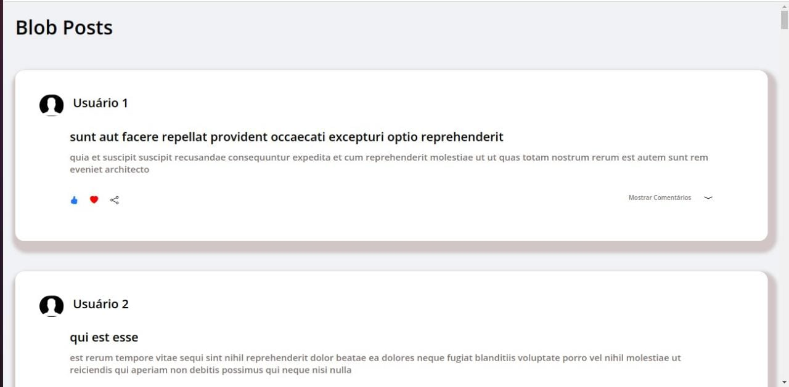
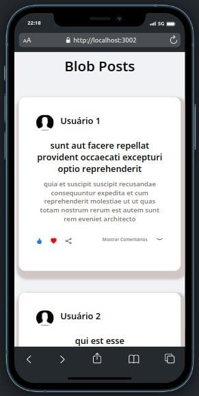

# Título do Projeto

Este projeto é um blog, onde através de requisições de uma API, conseguimos renderizar os Posts e seus comentários, com detalhes de usuários nos comentários.

## Tecnologias Utilizadas

- React.js
- Styled Components
- Media query (Responsividade)

## Como Usar

1. Clone o repositório
2. Instale as dependências com `npm install`
3. Execute o projeto com `npm start`

## Layout e Design

 

Este é o link do projeto para quem quiser dar uma olhadinha mais de perto !

Link: https://posts-blog-1k6lc3s53-willianamorim.vercel.app/

## Como Contribuir

1. Clone o repositório
2. Instale as dependências com `npm install`
3. Faça as mudanças necessárias e crie um novo branch com o nome da sua funcionalidade
4. Envie um pull request

## Contato

Entre em contato comigo pelo e-mail willianamorim1@outlook.com.br ou pelo LinkedIn: https://www.linkedin.com/in/willian-s-amorim/.